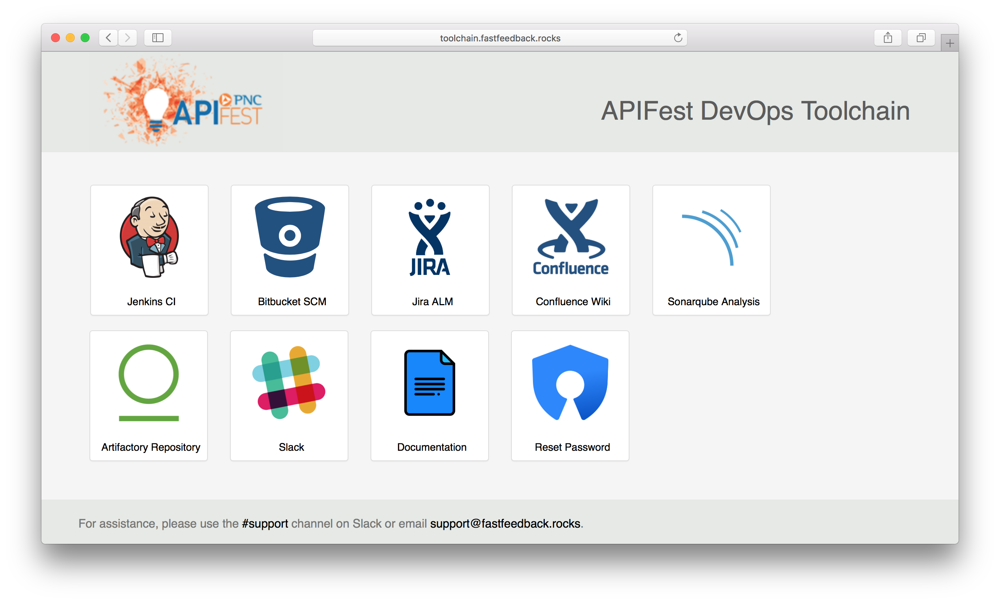

# Toolchain Overview

EVT provided a training overview of the DevOps toolchain on April 5. Below is a recording of the conversation.

  <iframe width="560" height="315" src="https://www.youtube-nocookie.com/embed/MJVi16xfbEw?rel=0" frameborder="0" allow="autoplay; encrypted-media" allowfullscreen></iframe>

## Quick Access
You can access the tools in the toolchain from <http://toolchain.fastfeedback.rocks/>.

  

  

