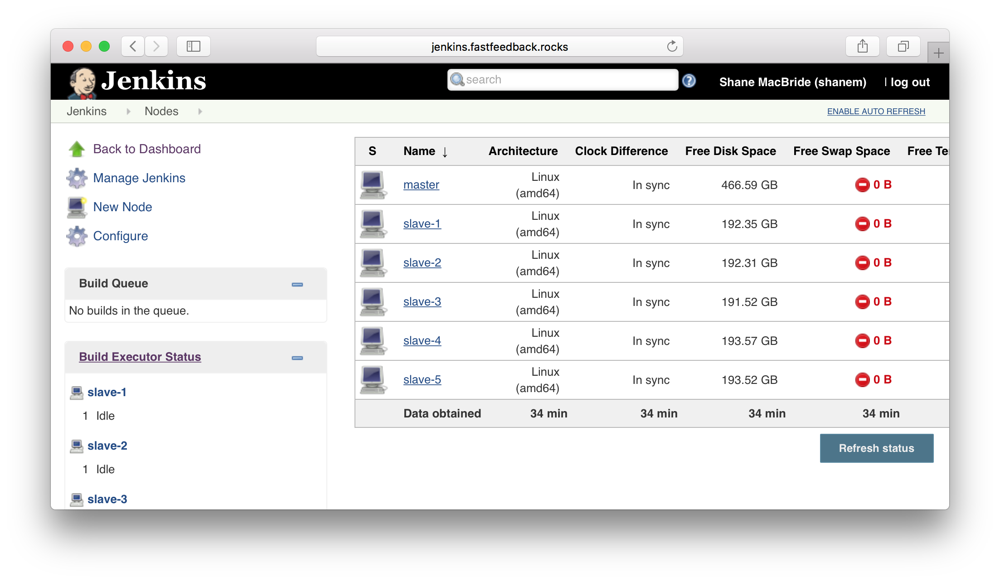

# Jenkins Agents

## About
> "Jenkins supports the 'master/agent' mode, where the workload of building projects are delegated to multiple 'agent' nodes, allowing a single Jenkins installation to host a large number of projects, or to provide different environments needed for builds/tests."
>
> \- [wiki.jenkins.io](https://wiki.jenkins.io/display/JENKINS/Distributed+builds)

  

## Quick Links
 - [jenkins.fastfeedback.rocks](http://jenkins.fastfeedback.rocks)
 - [jenkins.io](https://jenkins.io/)
 - [Jenkins Official Documentation](https://jenkins.io/doc)

  

