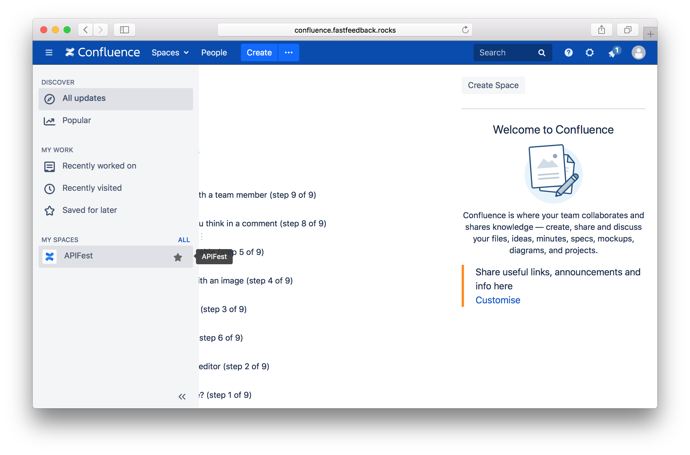

# Confluence

## About
> "Capture, store, and grow your team's knowledge so you can stay up to date and on the same page - literally."
>
> \- [atlassian.com](https://www.atlassian.com/software/confluence)

  

## Quick Links
 - [confluence.fastfeedback.rocks](http://confluence.fastfeedback.rocks)
 - [Confluence Website](https://www.atlassian.com/software/confluence)
 - [Confluence Documentation](https://confluence.atlassian.com/doc/confluence-server-documentation-135922.html)

  

