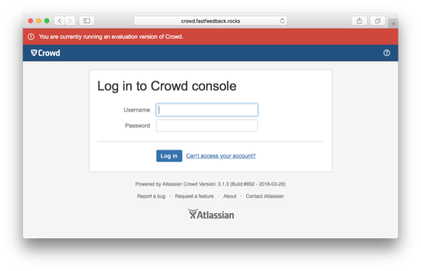
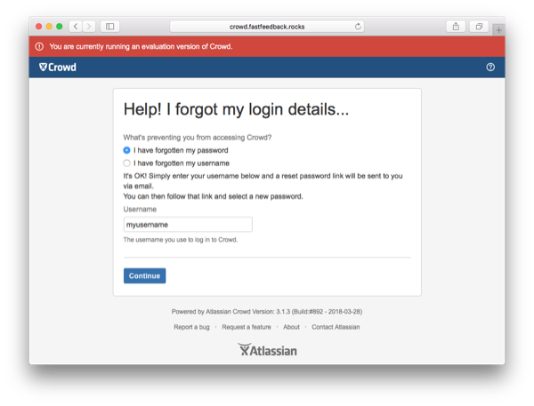
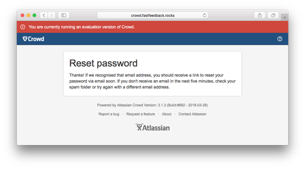
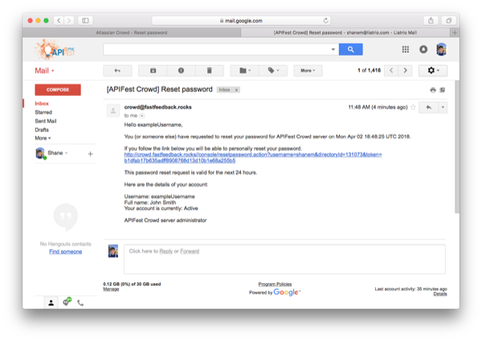
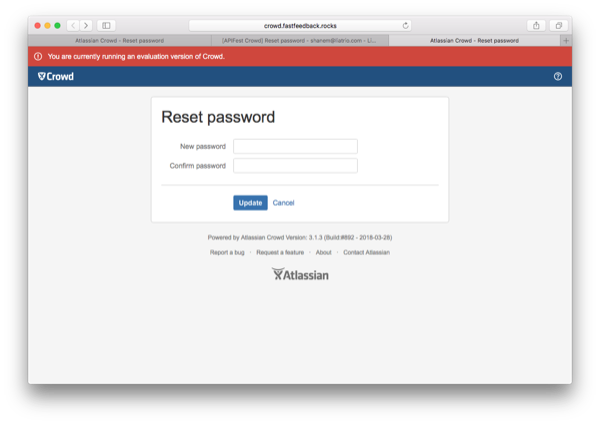
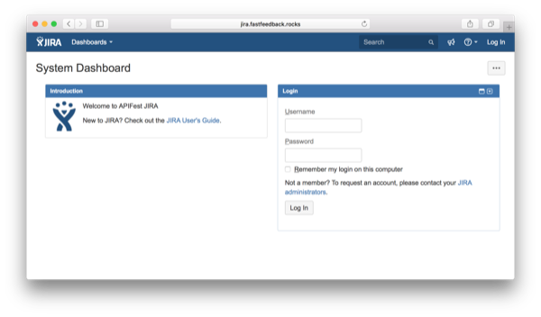

# Login to Crowd

When first using the tools in the toolchain, you'll need to reset your password for Crowd.

## Reset your Password
1. Navigate to [crowd.fastfeedback.rocks](http://crowd.fastfeedback.rocks) and click `Can't access your account?`.

  

2. Click the circle for `I have forgotten my password`. Enter your username in the text input box. Your username is the first part of your PNC email address.

  

3. You will receive an email to reset your password.

 
 

4. Check your inbox for the email containing the reset-password link. Click the link.

  

5. Enter your new password and click `Update`.

  

6. Success! Your password has been set. Login using your username and password.

  

  

