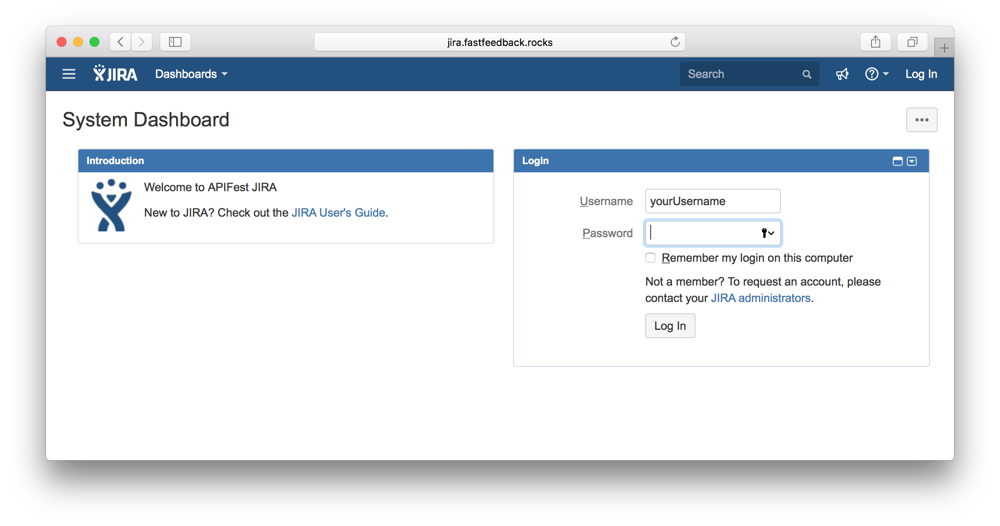
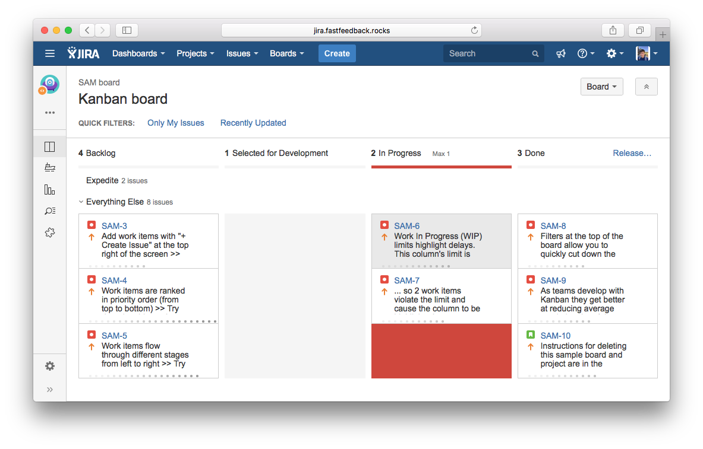
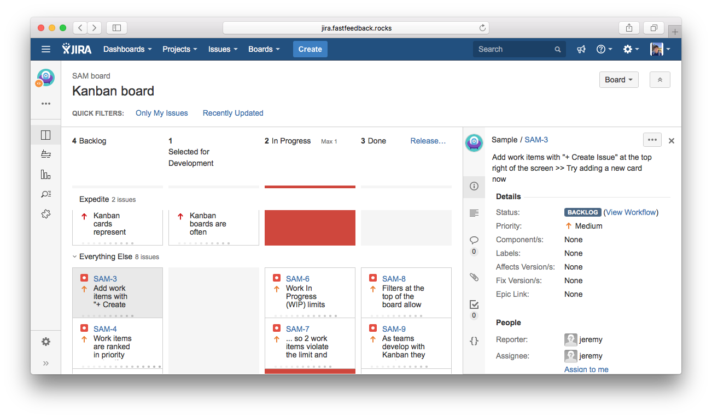
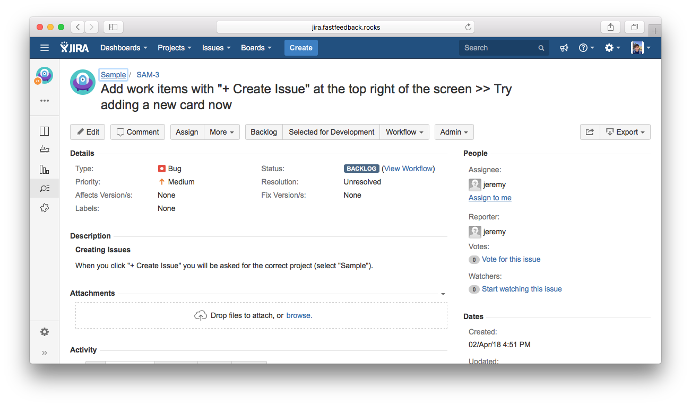
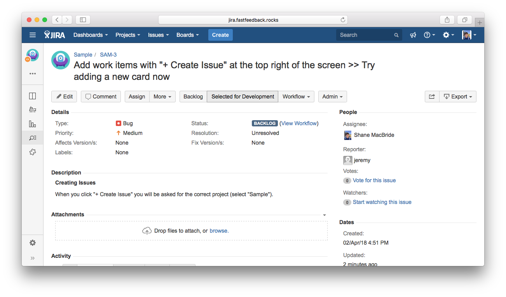
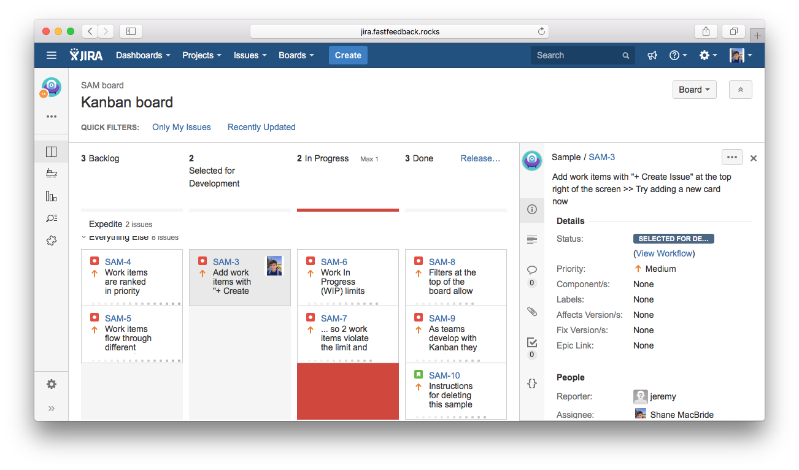

# Identify Task

1. Navigate to Jira at [jira.fastfeedback.rocks](http://jira.fastfeedback.rocks/).
2. Login using your APIFest username and password that you reset in section [3.1](https://docs.fastfeedback.rocks/#/3/3.1-login).

  

3. Navigate to [Boards](http://jira.fastfeedback.rocks/secure/ManageRapidViews.jspa) to view your project boards.
4. Locate your project's board. For this example, we will be using the sample board, SAM.

  

5. Select the top-left issue from the backlog. This will be the top priority. In this example, it is SAM-3. Once the ticket is selected, click the SAM-3 link on the top right to bring the issue into full-screen view.

  

6. Now that the issue is navigated to, hit the letter `i` on your keyboard to assign the ticket to yourself to indicate you have selected the issue for development. Alternatively, you can click the `Assign to me` link.

  

7. Click `Selected for Development`. This will indicate that you have chosen to start development on this issue and are proceeding to develop for the issue description.

  

8. If you refer back to the Board page from before, you should now see the issue assigned to yourself and in the `Selected for Development` column.

  

  

