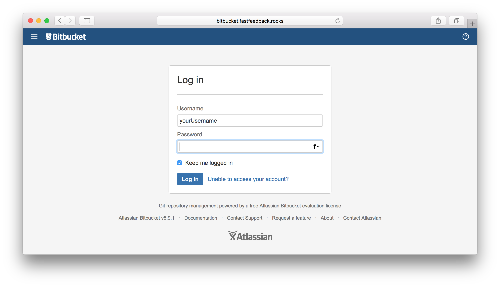
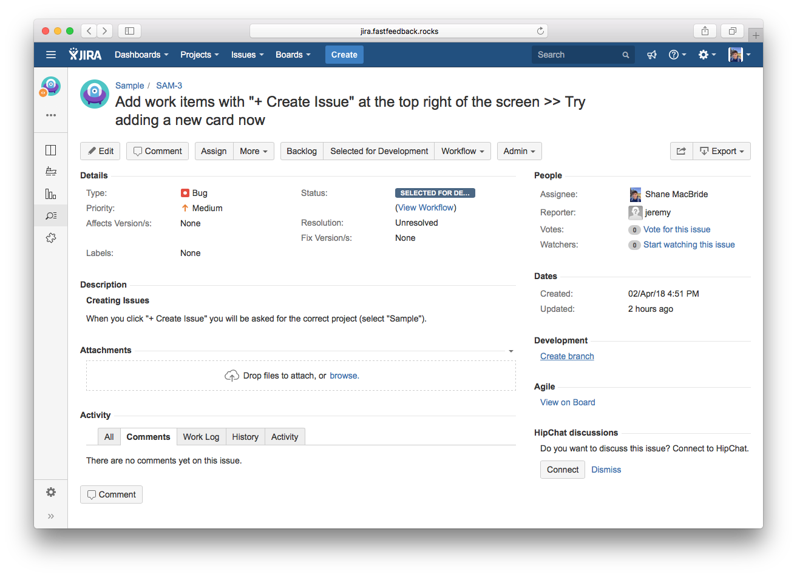
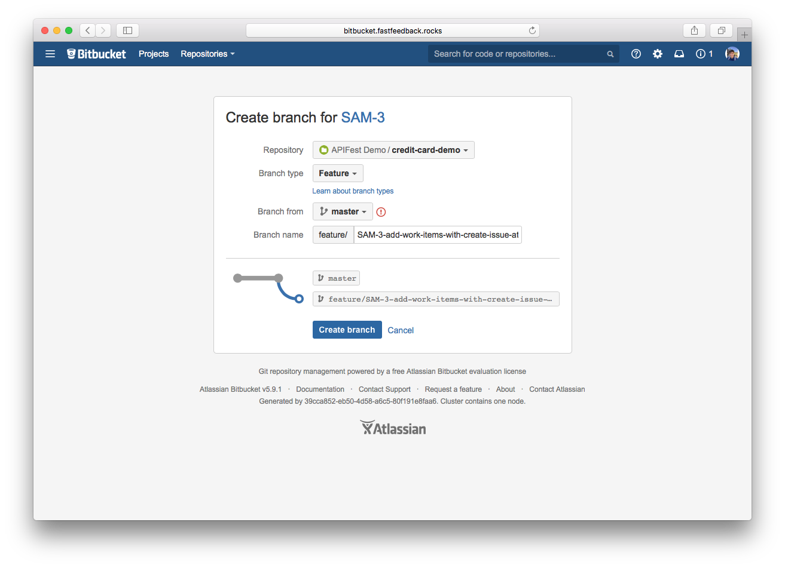
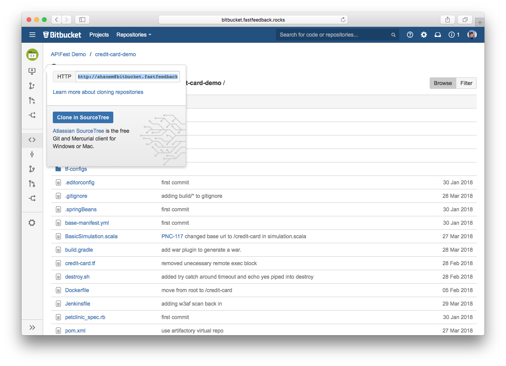
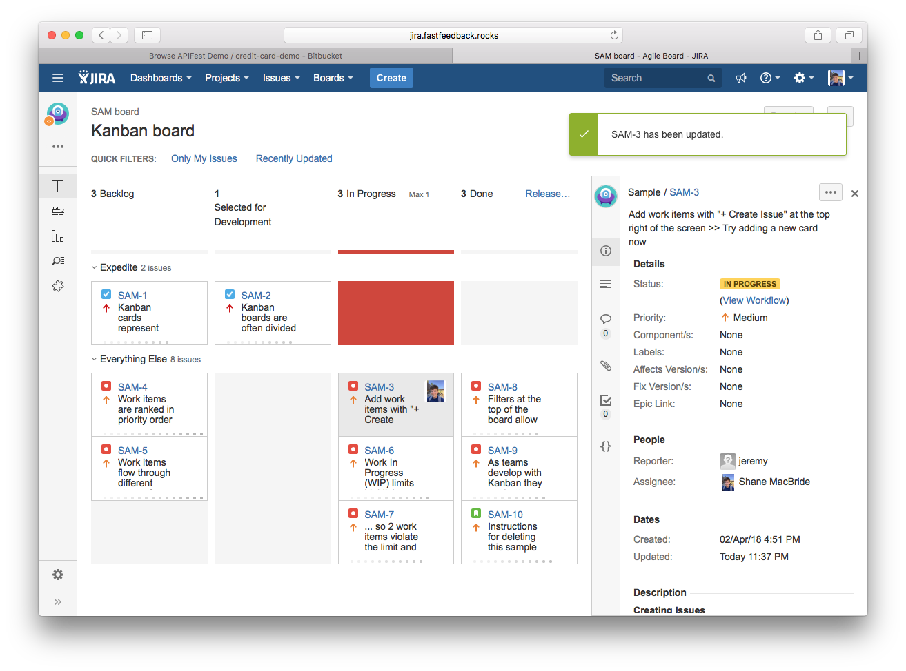

# Start Development

1. Navigate to [bitbucket.fastfeedback.rocks](http://bitbucket.fastfeedback.rocks/) and login using your PNC username and password that you reset in section [3.1](https://docs.fastfeedback.rocks/#/3/3.1-login).
<center>
  
</center>
2. Navigate to the issue you have assigned to yourself. You should see `Create branch` under `Development` on the right side-bar. Click `Create branch`.
<center>
  
</center>
3. Fill out the four options relevant to your issue and select `Create branch`.
<center>
  
</center>
4. This should forward you to the relevant repository on Bitbucket. On the top-left of the page, select the `Clone in SourceTree` icon and copy the URL displayed to your clipboard.
<center>
  
</center>
5. Using a Terminal on your computer, clone your repository locally using the copied URL, and change-directory into the newly cloned local directory.
```bash
git clone http://shanem@bitbucket.fastfeedback.rocks/scm/afd/credit-card-demo.git
cd credit-card-demo/
```
6. On the project board in Jira, drag-and-drop your issue into `In Progress`.
<center>
  
</center>

<center id="footer">
  
</center>
