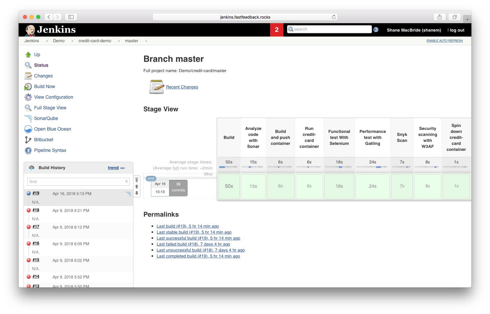

# Review Build

1. Navigate to [jenkins.fastfeedback.rocks](http://jenkins.fastfeedback.rocks/) and login using your APIFest username and password that you reset in section [3.1](https://docs.fastfeedback.rocks/#/3/3.1-login).

  

2. Review your build results. You can do this by navigating to the relevant job in Jenkins and clicking the blue or red circle next to the job in the queue.

  

3. Iterate if necessary based on the output of the build.

  

